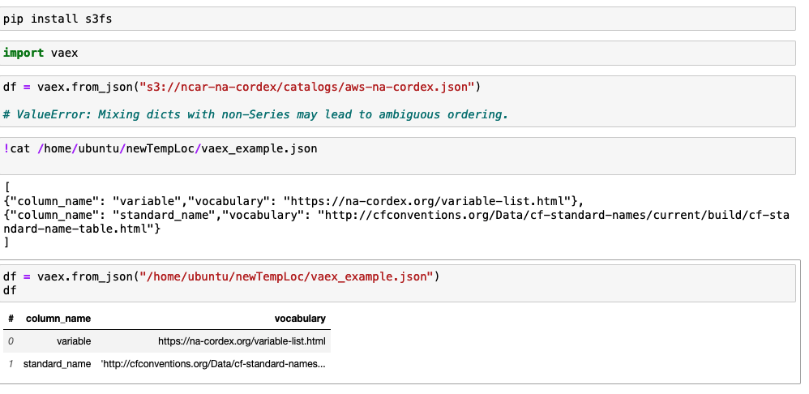

## Simple JSON example

* Install vaex
  * pip install --upgrade vaex
  * conda install -c conda-forge vaex
* Install s3fs to use vaex with objects on s3
  * pip install s3fs
* import vaex
* vaex.from_json on a dictionary or a json object gives the following error
  * ValueError: Mixing dicts with non-Series may lead to ambiguous ordering.  
* Use from_json on json files that have a json array of elements.
* For example, vaex_example.json has an array of json elements.
<code>
[
{"column_name": "variable","vocabulary": "https://na-cordex.org/variable-list.html"},
{"column_name": "standard_name","vocabulary": "http://cfconventions.org/Data/cf-standard-names/current/build/cf-standard-name-table.html"}
]
</code>

* Each key becomes a column name
* Each value becomes its value in a record.
* Reading JSON becomes as simple as vaex.from_json("s3://<bucket_name>/<prefix>/<object.json>")
* Support for [JSONL](https://jsonlines.org/) - yes! Just like Pandas, use <b>lines=True</b>
  * <code>data = pd.read_json('/path/to/file.json', lines=True)</code>
* Newly returned object can be used with an API that's (almost?) similar to Pandas Dataframe API.

